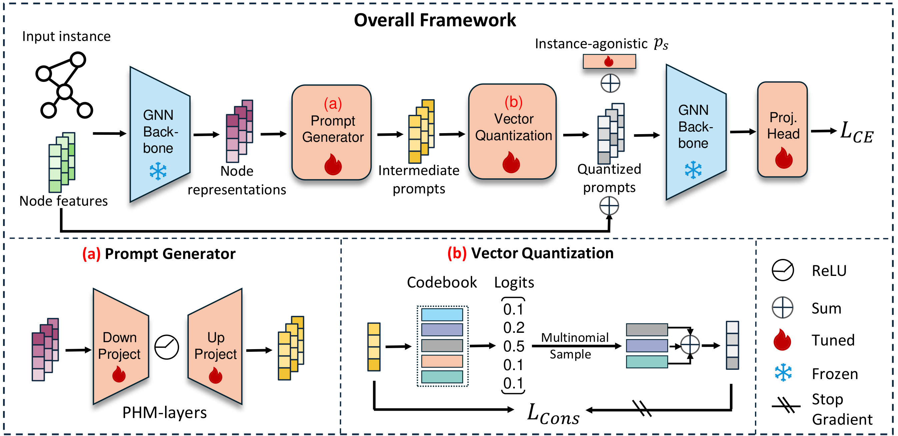

# IA-GPL

This repository contains the pytorch code for '**Instance-Aware Graph Prompt Learning**' which is under review. We insert instance-aware prompts to improve performance and efficiency in downstream graph-related tasks.

## Setup

<!-- Create a new conda environment and run `pip install -r requirements.txt` to install the packages. -->

```python
conda create -n IAGPL python=3.11
conda activate IAGPL
conda install -r requirements.txt
```

## Usage

```
python prompt_tuning.py 
```


## Reproduction

We have provided scripts with hyper-parameter settings to reproduce the experimental results presented in our paper. You can simply run:
`bash run_final.sh`

## Citation

TODO

---
This codebase is based on [GPF](https://github.com/zjunet/GPF). The pre-trained GNNs and datasets are from [repo](https://github.com/snap-stanford/pretrain-gnns).
 We thank authors for their great works.